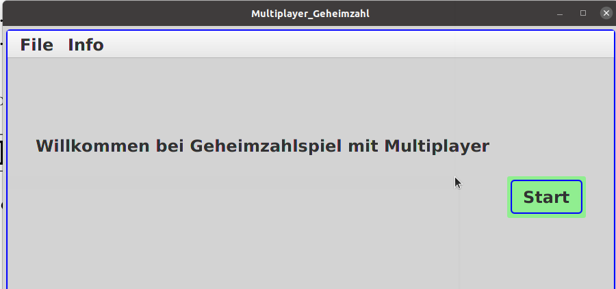

= Geheimzahlspiel

This Programm was developed in Java with the IDE IntelJ.

== How to run the application?
* In the IDE: find `????.java` , right-click, select "Run ????.main()

== defauflt windows

